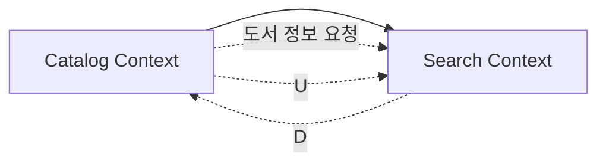

# 📚 도서 검색 시스템

## 📖 프로젝트 설명

### 개요
도서 검색 시스템은 MySQL의 FULLTEXT 검색 기능과 Redis를 활용한 인기 검색어 시스템을 구현한 Spring Boot 기반 웹 애플리케이션입니다. 사용자는 다양한 검색 전략(단순 검색, OR 연산, NOT 연산)을 통해 도서를 검색할 수 있으며, 실시간으로 인기 검색어를 확인할 수 있습니다.

### 주요 기능
- **📚 도서 전체 조회**: 등록된 모든 도서 목록 조회
- **🔍 도서 상세 조회**: 개별 도서의 상세 정보 조회
- **🔎 도서 검색**:
  - 키워드 검색: 단일 키워드 기반 검색
  - OR 연산자(`|`): 복수의 키워드에 대한 합집합 검색 전략을 적용한다
  - NOT 연산자(`-`): 포함/제외 검색 전략을 적용한다
- **🔥 인기 검색어**: 실시간 인기 검색어 Top 10 제공

## 🏗️ 도메인 모델 설명

### 도메인 정의
- **도메인**: "도서 검색" - 도서 정보 검색 및 관리를 위한 도메인

### 유비쿼터스 언어 (Ubiquitous Language)

#### 핵심 개념
- **도서 (Book)**: 검색 대상이 되는 도서 정보를 담는 핵심 엔티티
- **카탈로그 (Catalog)**: 도서 정보를 관리하는 카탈로그 시스템
- **검색 (Search)**: 도서를 찾기 위한 검색 시스템
- **검색어 (Search Keyword)**: 사용자가 입력하는 검색 키워드
- **검색 전략 (Search Strategy)**: 검색 방식을 결정하는 전략 패턴
- **인기 검색어 (Trending Keyword)**: 사용자들이 자주 검색하는 키워드

#### 검색 전략 세부 정의
- **단순 키워드 검색 (Single Keyword Search)**: 하나의 키워드로 정확히 매칭되는 도서 검색
- **OR 연산 검색 (OR Operation Search)**: 여러 키워드 중 하나라도 포함된 도서 검색 (`|` 구분자 사용)
- **NOT 연산 검색 (NOT Operation Search)**: 특정 키워드를 제외한 도서 검색 (`-` 구분자 사용)

#### 도서 속성
- **ISBN**: 도서의 고유 식별자
- **제목 (Title)**: 도서의 메인 제목
- **부제목 (Subtitle)**: 도서의 보조 제목
- **저자 (Author)**: 도서의 저자 정보
- **출판사 (Publisher)**: 도서를 출판한 회사
- **출판년도 (Published Year)**: 도서가 출판된 년도
- **평점 (Rating)**: 도서의 평점 정보
- **가격 (Price)**: 도서의 판매 가격
- **설명 (Description)**: 도서의 상세 설명
- **표지 이미지 URL (Book Cover Image URL)**: 도서 표지 이미지 경로

### Bounded Context

#### 1. Catalog Context
도서 정보 관리 및 조회를 담당하는 컨텍스트
- **Book Aggregate**: 도서 정보를 관리하는 핵심 Aggregate
  - **Root**: Book (도서)

#### 2. Search Context
도서 검색 및 인기 검색어 관리를 담당하는 컨텍스트

### Context Map



## 🚀 실행 방법

```bash
# 1. 프로젝트 클론
git clone [repository-url]
cd park-seoyeon-booksearch

# 2. 모든 서비스 시작
docker-compose up -d

# 3. 서비스 상태 확인
docker-compose ps

# 4. 로그 확인
docker-compose logs app
```

## 📚 API 문서

📖 **상세 API 명세서**: [Postman API 명세서](https://documenter.getpostman.com/view/21748120/2sB3HjMh2X#b7a3d451-8a52-4880-8695-96be5d4957b1)

### 도서 전체 조회
- `GET /api/v1/catalog/books?page={페이지}&size={크기}`

### 도서 상세 조회
- `GET /api/v1/catalog/books/{id}`

### 도서 검색
- `GET /api/v1/search/books?query={검색어}&page={페이지}&size={크기}`

### 인기 검색어 조회
- `GET /api/v1/trend/search/keywords`

## 🛠️ 기술 스택 및 결정 사항

- **언어**: Java 21
- **프레임워크**: Spring Boot 3.5.5
- **DB**: MySQL, Redis
  - **MySQL**: 조회 성능이 뛰어나고 FULLTEXT 검색 기능을 활용하여 효율적인 텍스트 검색 구현
  - **Redis**: 인메모리 특성으로 인기 검색어의 실시간 집계 및 빠른 조회 성능 제공
- **실행**: Docker Compose

## 🏛️ 아키텍처 결정 사항

### 전체 아키텍처
- **3-Tier Architecture**: Presentation Layer(Controller) → Business Layer(Service) → Data Layer(Repository)
- **Domain-Driven Design**: 도서 검색 도메인 중심의 패키지 구조

### 데이터베이스 설계
- **MySQL**: 도서 정보 저장 및 FULLTEXT 검색을 위한 메인 데이터베이스
- **Redis**: 인기 검색어 집계를 위한 캐시 데이터베이스
- **FULLTEXT Index**: title, subtitle 필드에 대한 텍스트 검색 최적화

### 검색 시스템 설계
- **Strategy Pattern**: 검색 전략(단순/OR/NOT)을 객체로 캡슐화
- **FULLTEXT Search**: MySQL의 Boolean Mode를 활용한 고성능 텍스트 검색
- **Pagination**: 대용량 데이터 처리를 위한 페이지네이션 지원

### 캐싱 전략
- **Redis Sorted Set**: 인기 검색어의 점수 기반 정렬 및 실시간 집계
- **TTL(Time To Live)**: 7일 만료로 데이터 자동 정리
- **In-Memory Storage**: 빠른 읽기/쓰기 성능 보장

## 🤔 문제 해결 중 고민 과정

### 검색 엔진 선택: Elasticsearch vs MySQL
- **MySQL FULLTEXT 선택 이유**: 한정된 시간 내에 우선 FULLTEXT 검색으로 구현하고, 나중에 데이터가 증가하고 검색 성능을 높여야 할 때 Elasticsearch 도입을 고려하기 위함

### 검색 방식 선택: LIKE vs FULLTEXT
- **LIKE vs FULLTEXT 비교**: 
  - **LIKE 장점**: 구현 간단, 모든 데이터베이스 지원, 유연한 패턴 매칭
  - **LIKE 단점**: 인덱스 활용 불가, 전체 테이블 스캔, 성능 저하
  - **FULLTEXT 장점**: 인덱스 기반 빠른 검색, 불용어 제거, 관련도 순 정렬
  - **FULLTEXT 단점**: 복잡한 쿼리, 메모리 사용량 증가, 특정 DB만 지원
- **결론**: 검색 성능과 정확도 향상을 위해 FULLTEXT 선택

### 검색 정확도 vs 유연성
- **정확도 우선 결정**: 검색 정확도에 초점을 맞춰 FULLTEXT에서 기본 지원하는 대소문자 구분 없음만 적용

### 인기 검색어 저장소 선택: Redis
- **Redis 선택 이유**: 
  - 인메모리 기반으로 빠른 읽기/쓰기 성능
  - Sorted Set 자료구조로 점수 기반 정렬 자동 지원
  - TTL 기능으로 데이터 자동 만료 관리
  - 인기 검색어 기능 구현에 최적화된 구조

### 검색어 정규화: 대소문자 처리
- **정확한 반영을 위해**: `java`, `Java`, `JAVA`를 모두 다르게 저장하여 사용자 검색 패턴을 정확히 반영

### 초기 데이터 시딩 방법
- **JSON 파일 선택**: 
  - API 실시간 호출 시 네트워크 오류, 타임아웃 등 예외 상황 발생 가능성
  - 미리 정제된 JSON 데이터로 안정적인 초기 데이터 로드

### 검색 전략 설계
- **통합 검색 API**: 키워드 검색과 복합 검색을 모두 검색 기능 하위의 전략으로 분류하여 하나의 쿼리를 받은 후 3가지 전략(단순/OR/NOT)으로 분기하는 로직 구현

### 고유키 설계: ISBN vs ID
- **ID + ISBN Unique**: ISBN은 변경 가능성이 있어 단독 고유키로 사용하기 부적절하므로 별도 ID를 Primary Key로 설정하고 ISBN은 Unique 제약조건으로 관리

